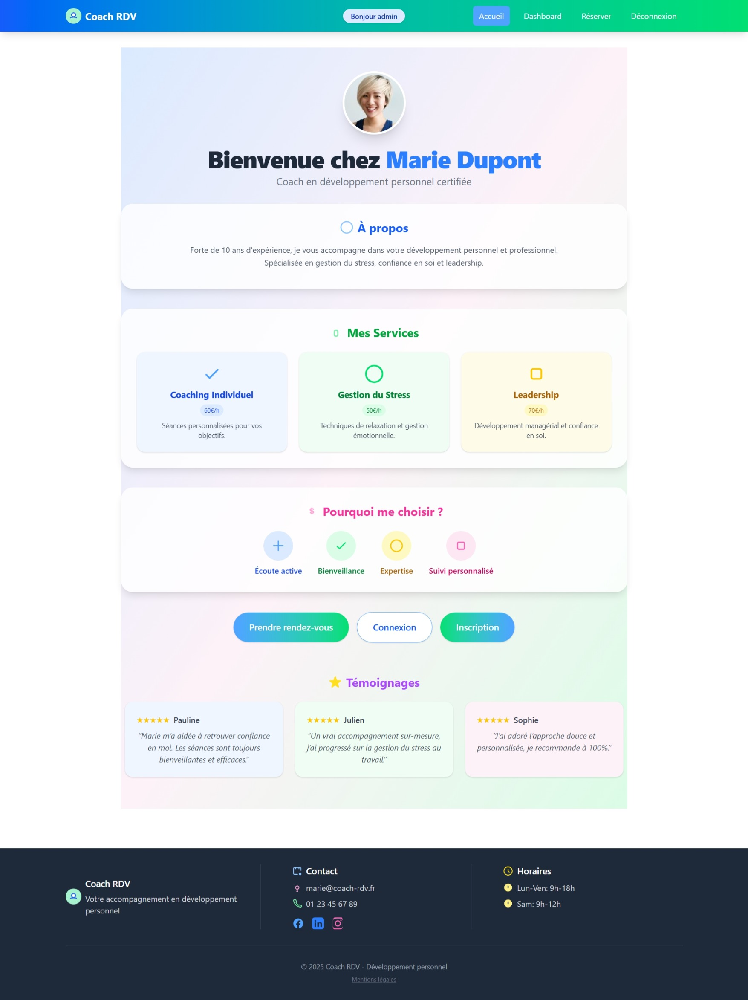

# Django Coach RDV

Application web moderne de prise de rendez-vous pour un coach en développement personnel, avec calendrier interactif, gestion avancée des créneaux, dashboards personnalisés, et design responsive.

 <!-- Ajoute une capture d'écran ici si possible -->

## 📝 Présentation

Cette application permet à un coach (Marie Dupont) de gérer ses disponibilités et à ses clients de réserver des séances en ligne. Elle propose :

- Un design pastel moderne, responsive, avec logo SVG, navbar, footer, et effets visuels
- Un calendrier interactif (FullCalendar) pour visualiser et réserver les créneaux disponibles
- Des dashboards dédiés pour le coach et les clients
- Une gestion stricte des permissions et de la sécurité
- Une expérience utilisateur soignée (tooltips, alertes, pré-remplissage, etc.)

## 🎯 Fonctionnalités principales

### Côté client

- Inscription, connexion, déconnexion
- Prise de rendez-vous sur créneaux de 30 min (9h-18h)
- Visualisation des créneaux disponibles via un calendrier interactif (FullCalendar)
- Dashboard personnel : RDV à venir, historique, statistiques
- Annulation de RDV (si implémenté)

### Côté coach

- Dashboard coach : vue d’ensemble de toutes les séances (calendrier interactif)
- Gestion des créneaux de disponibilité (création, suppression, validation)
- Notes privées sur chaque client/séance
- Statistiques (nombre de séances, clients actifs)
- Accès sécurisé (coach/admin uniquement)

### Logique métier & sécurité

- Validation stricte des créneaux (pas de doublon, pas de réservation dans le passé, gestion des conflits)
- Permissions avancées (groupes Coach/Client, accès restreint aux dashboards)
- Gestion dynamique des créneaux via API (navigation infinie dans le calendrier)
- Messages d’alerte et feedback utilisateur

### UX/UI

- Design pastel, logo SVG, responsive (mobile/desktop)
- Navbar, footer, badges utilisateur, effets de survol, tooltips
- Séparation visuelle nette entre formulaire et calendrier

## 🏗️ Architecture technique

- **Django 5.2.4** (backend, logique métier, API)
- **django-tailwind** (intégration Tailwind CSS 4.x)
- **FullCalendar.js** (calendrier interactif, navigation, tooltips)
- **SQLite** (développement)
- Organisation Django classique :
  - `coachrdv/` : configuration principale
  - `accounts/` : authentification, profils, gestion coach/client, créneaux, notes
  - `rdv/` : gestion des rendez-vous, API calendrier, vues principales
  - `theme/` : intégration Tailwind, templates, statiques

```
Django_coach_rdv_project/
├── coachrdv/              # Configuration principale
├── accounts/              # Authentification, profils, créneaux, notes
├── rdv/                   # Rendez-vous, API calendrier, vues
├── theme/                 # Thème Tailwind CSS, templates, statiques
├── db.sqlite3             # Base de données
└── manage.py              # Script de gestion Django
```

## 📡 API calendrier (FullCalendar)

- **Endpoint** : `/api/creneaux/`
- **Méthode** : GET
- **Paramètres** : `start`, `end` (dates ISO)
- **Réponse** : liste des créneaux disponibles/réservés au format FullCalendar

Exemple :

```http
GET /api/creneaux/?start=2025-07-01&end=2025-07-07
```

Réponse :

```json
[
  {
    "title": "Disponible",
    "start": "2025-07-01T09:00:00",
    "end": "2025-07-01T09:30:00",
    "backgroundColor": "#A7F3D0"
  },
  {
    "title": "Réservé",
    "start": "2025-07-01T10:00:00",
    "end": "2025-07-01T10:30:00",
    "backgroundColor": "#FCA5A5"
  }
]
```

## 🚀 Installation

1. **Clonez le repository**
   ```bash
   git clone <url-du-repo>
   cd Django_coach_rdv_project
   ```
2. **Activez l'environnement virtuel**
   ```bash
   # Depuis la racine du projet
   source env/Scripts/activate  # Windows/Git Bash
   # ou
   source env/bin/activate      # Linux/macOS
   ```
3. **Installez les dépendances**
   ```bash
   pip install -r requirements.txt
   ```
4. **Naviguez vers le projet Django**
   ```bash
   cd Django_coach_rdv_project
   ```
5. **Appliquez les migrations**
   ```bash
   python manage.py migrate
   ```
6. **Créez le compte coach**
   ```bash
   python manage.py create_coach
   ```
   Cela créera le compte :
   - **Username** : `marie_coach`
   - **Password** : `coach123!`
   - **Email** : `marie@coach-rdv.fr`
7. **Lancez le serveur**
   ```bash
   python manage.py runserver
   ```
8. **Accédez à l'application**
   - Site web : http://127.0.0.1:8000/
   - Admin Django : http://127.0.0.1:8000/admin/

## 👥 Comptes de test

### Coach

- **Username** : `marie_coach`
- **Password** : `coach123!`
- **Accès** : Dashboard coach, gestion créneaux, notes, statistiques

### Clients

- Inscription via le formulaire (rôle client par défaut)
- Prise de rendez-vous, consultation du planning, historique

## 💡 Scénarios d’utilisation

- **Client** : s’inscrit, réserve un créneau via le calendrier, consulte ses RDV, annule si besoin
- **Coach** : gère ses créneaux, visualise les RDV sur le calendrier, ajoute des notes, consulte ses stats
- **Navigation** : accueil, dashboards, formulaire de RDV, calendrier interactif, gestion des créneaux

## 🛠️ Commandes utiles

```bash
# Créer un superutilisateur
python manage.py createsuperuser
# Créer le compte coach par défaut
python manage.py create_coach
# Créer un coach personnalisé
python manage.py create_coach --username=autre_coach --email=autre@coach.fr
# Lancer les tests
python manage.py test
# Collecter les fichiers statiques (production)
python manage.py collectstatic
```

## ✅ Tests et qualité

- Tests unitaires et d’intégration (voir `accounts/tests.py`, `rdv/tests.py`)
- Validation stricte des formulaires et des permissions
- Code nettoyé, redondances supprimées, organisation cohérente

## 📋 TODO / Améliorations futures

- [ ] Notifications par email
- [ ] Système de paiement
- [ ] API REST complète
- [ ] Application mobile
- [ ] Système de rappels
- [ ] Multi-coachs
- [ ] Statistiques visuelles avancées
- [ ] Édition directe sur le calendrier
- [ ] Notifications push

## 🎓 Préparation à la soutenance

- Préparez des captures d’écran des principales pages (accueil, dashboard, calendrier)
- Montrez la prise de RDV en temps réel (client/coach)
- Présentez la gestion des créneaux côté coach
- Mettez en avant la sécurité (permissions, validation)
- Montrez le design responsive sur mobile/tablette
- (Optionnel) Ajoutez une vidéo de démonstration

## 📄 Licence

MIT License – voir le fichier LICENSE pour plus de détails.

## 🙏 Crédits & remerciements

- Projet développé dans le cadre d’un TP Django – Application de prise de rendez-vous pour coach en développement personnel.
- Merci à [FullCalendar](https://fullcalendar.io/), [Tailwind CSS](https://tailwindcss.com/), et la communauté Django.

---

_N’hésitez pas à contribuer ou à signaler des bugs/propositions d’amélioration !_
